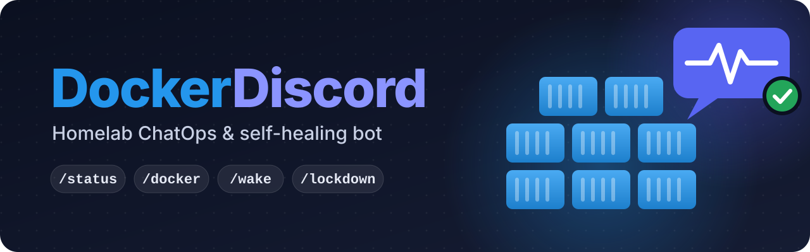

<p align="center">
  
</p>

# DockerDiscord

[](https://github.com/Macaron27/DockerDiscord/actions/workflows/ci.yml?query=branch%3Amain)
[](bot)
[](docker-compose.yml)
[](https://discordpy.readthedocs.io/)
[](https://github.com/Macaron27/DockerDiscord/commits/main)
[](LICENSE)

A Discord bot that controls a homelab with slash commands and posts incident alerts with remediation buttons.

| Command | What it does |
|---|---|
| `/status [all\|host\|zfs\|ups]` | CPU, RAM, load, temperature, top 3 containers by RAM, ZFS pool state, UPS (NUT) |
| `/docker <status\|restart\|stop\|logs> <container>` | Container names autocomplete. `restart`/`stop` ask for confirmation. `logs` shows the last 30 lines, ANSI stripped, as a `.txt` file if over 1900 chars |
| `/wake <host>` | Sends a Wake-on-LAN packet, then checks the host every 5 s for up to 90 s and edits the reply when it's up |
| `/lockdown` | Asks for confirmation, then stops `LOCKDOWN_CONTAINERS` (external ingress only) |

Alerts go to `ALERT_CHANNEL_ID` with **🔄 Restart**, **📜 Tail 50 Logs** and **🔇 Acknowledge / Silence 1h** buttons. They come from:
- Docker events: `die` with a non-zero exit code (except deliberate stops), `oom`, `health_status: unhealthy`;
- `POST /webhook/alert` from Uptime Kuma, Prometheus Alertmanager or Grafana, sent with `Authorization: Bearer <WEBHOOK_SECRET>`.

Only user IDs in `ALLOWED_USER_IDS` can run commands, use autocomplete or press buttons. Everyone else is ignored and the attempt is logged.

## Layout

```
bot/
  __main__.py, app.py     entrypoint; Discord + webhook server on one asyncio loop, SIGTERM-safe
  config.py               env parsing, fails fast on bad values
  guards.py               ALLOWED_USER_IDS check (tree + views), confirmation prompt, error reply
  cogs/docker.py          /docker + autocomplete
  cogs/system.py          /status, /wake, /lockdown
  cogs/alerts.py          Docker event thread, webhook server, incident embeds, persistent buttons
  services/docker.py      async wrapper over docker-py (runs blocking calls in threads)
  services/incidents.py   event triage, cooldown/silence
  services/system.py      psutil, ZFS kstat, NUT client, WoL packet, TCP up-check
  webhooks/server.py      POST /webhook/alert (Kuma / Alertmanager / Grafana)
tests/                    pytest, no network or Docker needed
```

## Deploy

1. **Discord:** create an application at <https://discord.com/developers/applications> and add a bot. No privileged intents are needed. Invite it with the `bot` and `applications.commands` scopes and permissions `52224` (View Channels, Send Messages, Embed Links, Attach Files):
   `https://discord.com/oauth2/authorize?client_id=<APP_ID>&scope=bot+applications.commands&permissions=52224`
2. `cp .env.example .env` and fill it in. `DOCKER_GID` comes from `stat -c %g /var/run/docker.sock`.
3. `docker compose up -d --build`, then `docker compose logs -f bot`. Wait for `synced 4 slash commands` and `logged in as …`.

### Why host networking

- **Wake-on-LAN:** magic packets are broadcasts, and a router (here, the Docker bridge) must not forward limited broadcasts (RFC 1812 §5.3.5.1). The bot therefore uses `network_mode: host`.
- **Up-check:** Docker only enables unprivileged ICMP for containers with their own network namespace, and the bot runs with `cap_drop: ALL`. So `/wake` checks "online" with a TCP connect to `WOL_HOSTS[].port`. A refused connection still counts as up.
- **Proxy:** `wollomatic/socket-proxy` then listens on `127.0.0.1:2375` only.

### What the proxy allows

GET: `version`, `events`, and container `json`/`logs`/`stats`. POST: `/containers/<name>/(stop|restart)` only.

There's no `create`, `start`, `exec`, `archive` or `export`. So even if the bot is compromised, it cannot start a privileged container or read files out of containers. `tests/test_proxy_allowlist.py` checks these regexes against the exact URLs docker-py sends.

## Wire up alert sources

Use `http://<docker-host-ip>:8080/webhook/alert` in all three.

- **Uptime Kuma:** Notification → Webhook, body *application/json*, *Additional Headers* `{"Authorization": "Bearer <WEBHOOK_SECRET>"}`. Only DOWN heartbeats alert. The Test button returns 202 and posts nothing.
- **Alertmanager:**
  ```yaml
  receivers:
    - name: discord
      webhook_configs:
        - url: http://<host>:8080/webhook/alert
          http_config:
            authorization: { type: Bearer, credentials_file: /etc/alertmanager/webhook_secret }
  ```
  A `container`, `container_name` or `name` label enables the Restart/Logs buttons.
- **Grafana:** Webhook contact point → Optional settings → *Authorization Header*, scheme `Bearer`, credentials `<WEBHOOK_SECRET>`.

Only firing alerts are posted, and resolved notifications are ignored. The same alert on the same target is posted at most once per `ALERT_COOLDOWN_S`. If Discord delivery fails, the webhook returns 500 so the sender retries.

## Develop and test

```bash
python3 -m venv .venv && .venv/bin/pip install --require-hashes -r requirements.txt && .venv/bin/pip install --group dev
```

```bash
.venv/bin/python -m pytest -q --cov && .venv/bin/ruff format --check bot tests && .venv/bin/ruff check bot tests && .venv/bin/mypy
```

CI (`.github/workflows/ci.yml`) runs the same checks on native amd64 and arm64 runners, builds the image for both, and smoke-tests it hardened like the compose file. Coverage below 90% fails the build. The tests fake Discord and Docker, so they need no network. That includes `tests/test_proxy_allowlist.py`, which runs the proxy regexes against the URLs docker-py really sends.

**Dependencies:** `requirements.in` lists the direct pins. `requirements.txt` is the hash-locked lock for every platform, and the Dockerfile installs it wheels-only with `--require-hashes`. After changing `requirements.in`, regenerate it:

```bash
.venv/bin/uv pip compile requirements.in --universal --python-version 3.14 --generate-hashes -o requirements.txt
```

## First-run smoke test (on the real host)

The automated tests fake Discord and Docker. Check these once for real:

1. As a user **not** in `ALLOWED_USER_IDS`, run `/docker status x`. You get no answer, and the bot log shows `unauthorized application_command from user=…`.
2. `/status`: CPU, RAM and load should match `htop` on the host. If *ZFS* says "No pools visible" or *Temp* is missing, `/proc/spl/kstat/zfs` or the hwmon sensors aren't visible inside the container on this host.
3. `/docker logs <name>` and `/docker restart <name>`: the confirmation expires after 30 s. The restart must **not** trigger a crash alert.
4. `docker run -d --name crashme alpine sh -c 'sleep 5; exit 3'`: an alert appears within about 5 s. Press 📜, then 🔇 (the embed gets stamped), then `docker rm crashme`.
5. `curl -i -X POST http://<host>:8080/webhook/alert -H 'Authorization: Bearer wrong' -d '{}'` returns `401`.
6. `/wake <host>` with the target powered off: the reply turns 🟢 once it boots.
7. `/lockdown` in a maintenance window, then `/docker restart <name>` for each container to undo it.

## License

[MIT](LICENSE) © 2026 Macaron27. Dependencies keep their own licenses (MIT, Apache-2.0, BSD-3-Clause, PSF-2.0, MPL-2.0).
